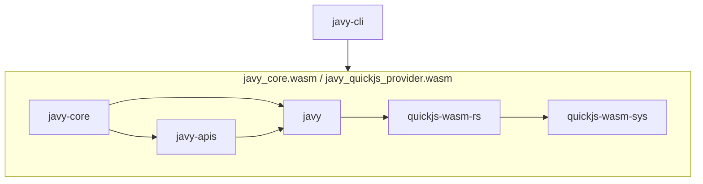

# Architecture of Javy

This document is intended to provide an overview of the crates and NPM packages in Javy.

## Crates

We anticipate most changes will be to the `javy`, `javy-apis`, and `quickjs-wasm-rs` crates.

### `javy`

The entrypoint for working with Javy as a library for third parties. This crate is intended to compile to `wasm32-wasi` and provide ergonomic APIs for configuring a QuickJS-based runtime. If there is a configuration option for QuickJS that would be helpful, this is the place to add it.

#### Important concepts

- `javy::Runtime` - a configurable QuickJS runtime.
- `javy::Config` - a configuration for the runtime.

### `javy-apis`

Common JS APIs for use with a `javy::Runtime`. For example, `console`, `TextEncoder`, `TextDecoder`. If there is a standard JS API that seems like it would be useful to multiple users of Javy, it should be implemented in this crate. If this is an API specific to your use case, you should define it in a crate of your own and register the implementation using a similar approach to how the APIs in this crate define their implementations.

#### Adding an API implementation

1. Add a feature to the crate's `Cargo.toml` for your module.
2. Create a directory under `src` with a `mod.rs` file.
3. If your API implementation requires configuration, create a configuration struct for the configuration properties required in your module.
4. In `mod.rs`, implement the `crate::JSApiSet` trait. If your API requires configuration, add the configuration struct defined earlier to the `crate::ApiConfig` struct under a `#[cfg(feature = "your feature name")]` attribute.
5. If necessary, add any JS source files inside the module you're adding.
6. Add the `mod` to the crate's `lib.rs` under a `#[cfg(feature = "your feature name")]` attribute.
7. Add a call to your struct's `register` method under a `#[cfg(feature = "your feature name")]` in `lib.rs`'s `add_to_runtime` function.

### `javy-cli`

The CLI for compiling JS to Wasm. This isn't intended to be a CLI that accommodates all uses for all users but rather to provide a useful base of functionality. This is kind of similar to how Wasmtime ships with a crate and a CLI and doing non-generic things with Wasmtime requires writing your own CLI around the Wasmtime crate.

### `javy-core`

Gets compiled to `javy_core.wasm` and `javy_quickjs_provider.wasm` for use by the CLI and in environments for running dynamically linked modules. This isn't intended to be used as a code library by third parties. Contains logic for driving the `javy` crate for Wasm modules generated by `javy-cli`.

### `quickjs-wasm-rs`

Provides an ergonomic API around the `quickjs-wasm-sys` crate as well as a `serde` implementations for `JSValueRef`.

### `quickjs-wasm-sys`

A Rust wrapper around the QuickJS C library.

## NPM packages

### `javy`

A JS library providing ergonomic helpers around the lower level APIs for I/O exposed by `javy-apis`.

### `javy-cli`

The package that enables using the `javy-cli` through NPM. You can use `npx javy-cli` to run various Javy commands.
