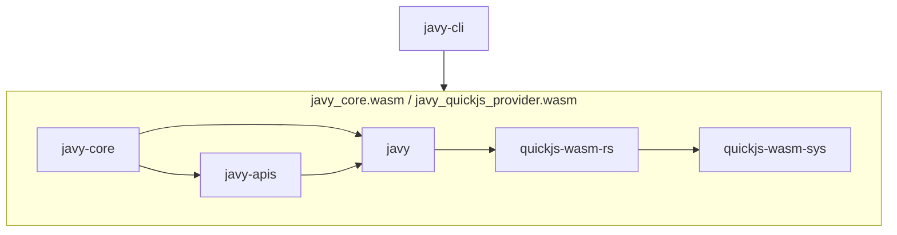

# Architecture of Javy

This document is intended to provide an overview of the crates and NPM packages in Javy.

## Crates



We anticipate most changes will be to the `javy`, `javy-apis`, and `quickjs-wasm-rs` crates.

### `javy`

The entrypoint for working with Javy as a library for third parties. This crate is intended to compile to `wasm32-wasi` and provide ergonomic APIs for configuring a QuickJS-based runtime. If there is a configuration option for QuickJS that would be helpful, this is the place to add it.

#### Important concepts

- `javy::Runtime` - a configurable QuickJS runtime.
- `javy::Config` - a configuration for the runtime.

#### Example of a change

This is a contrived example of how to make a change. If I want to add a configuuration to set a global variable called `javy_rocks` to `true`, I would do the following:

In `crates/javy/src/config.rs`:

```diff
  /// A configuration for [`Runtime`](crate::Runtime).
  #[derive(Debug)]
  pub struct Config {
+     pub(crate) set_javy_rocks: bool,
  }

  impl Default for Config {
      /// Creates a [`Config`] with default values.
      fn default() -> Self {
          Self {
+             set_javy_rocks: false,
          }
      }
  }

  impl Config {
+     /// Sets `globalThis.javy_rocks` to `true`.
+     pub fn set_javy_rocks(&mut self) -> &mut Self {
+         self.set_javy_rocks = true;
+         self
+     }
  }
```

We require creating a method to set the property and it should return `&mut Self` so it can be chained.

In `crates/javy/src/runtime.rs`:

```diff
  impl Runtime {
      /// Creates a new [`Runtime`].
      pub fn new(config: Config) -> Result<Self> {
          let context = JSContextRef::default();
+         if config.set_javy_rocks {
+             context
+                 .global_object()?
+                 .set_property("javy_rocks", context.value_from_bool(true)?)?;
+         }
          Ok(Self { context })
      }
```

Read the `config` and call the appropriate methods on `context` to apply the configuration.

#### When to add a Cargo feature

You should consider gating your feature by a Cargo feature when:

- Your feature would materially increase the size of the produced Wasm module.
- Your feature requires enabling additional features in the `quickjs-wasm-rs` crate.

These are guidelines and we're willing to discuss if a feature needs to be gated by a Cargo feature on a case-by-case basis.

### `javy-apis`

Common JS APIs for use with a `javy::Runtime`. For example, `console`, `TextEncoder`, `TextDecoder`. If there is a standard JS API that seems like it would be useful to multiple users of Javy, it should be implemented in this crate. If this is an API specific to your use case, you should define it in a crate of your own and register the implementation using a similar approach to how the APIs in this crate define their implementations.

#### Adding an API implementation

1. Add a feature to the crate's `Cargo.toml` for your module.
2. Create a directory under `src` with a `mod.rs` file.
3. If your API implementation requires configuration, create a configuration struct for the configuration properties required in your module.
4. If necessary, add any JS source files inside the module you're adding. If you can implement your API without JS, you don't need to add any.
5. In `mod.rs`, implement the `crate::JSApiSet` trait. If your API requires configuration, add the configuration struct defined earlier to the `crate::ApiConfig` struct under a `#[cfg(feature = "your feature name")]` attribute.
6. Add the `mod` to the crate's `lib.rs` under a `#[cfg(feature = "your feature name")]` attribute.
7. Add a call to your struct's `register` method under a `#[cfg(feature = "your feature name")]` in `lib.rs`'s `add_to_runtime` function.

##### Example

Here's a contrived example of adding an API to print an environment variable with a prefix that's configured when creating a Javy runtime. Normally this wouldn't go in this crate, but instead in your own crate since it's not a generally useful API.

Create the directory, `crates/apis/src/env_var_printer`.

In `crates/apis/Cargo.toml`:

```diff
  [features]
  console = []
+ env_var_printer = []
  random = ["dep:fastrand"]
  stream_io = []
  text_encoding = []
```

In `crates/apis/src/env_var_printer/config.rs`:

```rust
use crate::APIConfig;

// Use crate visibility to avoid exposing the property outside the crate
#[derive(Debug)]
pub(crate) struct EnvVarConfig {
    pub(super) prefix: String,
}

// Always have a default value for every config.
impl Default for EnvVarConfig {
    fn default() -> Self {
        Self {
            prefix: "Default prefix: ".to_string(),
        }
    }
}

// Define one or more methods on `APIConfig`, not `EnvVarConfig`, to set properties.
impl APIConfig {
    /// Sets the prefix for `Javy.Env.print`.
    pub fn prefix(&mut self, prefix: String) -> &mut Self {
        self.env_var.prefix = prefix;
        self
    }
}
```

In `crates/apis/src/env_var_printer/env-var-printer.js`:

```js
// Wrap everything in an anonymous function to avoid leaking local variables into the global scope.
(function () {
  // Get a reference to the function before we delete it from `globalThis`.
  const __javy_env_printEnvVar = globalThis.__javy_env_printVal;
  globalThis.Javy.Env = {
    print(name) {
      __javy_env_printEnvVar(name);
    },
  };
  // Delete the function from `globalThis` so it doesn't leak.
  Reflect.deleteProperty(globalThis, "__javy_env_printVal");
})();
```

For something this simple, you don't need a JS file, I'm including it to demonstrate how things would be wired up.

In `crates/apis/src/env_var_printer/mod.rs`:

```rust
use std::env;

use anyhow::{bail, Result};
use javy::{quickjs::JSValue, Runtime};

use crate::{APIConfig, JSApiSet};
pub(super) use config::EnvVarConfig;

mod config;

pub(super) struct EnvVarPrinter;

impl JSApiSet for EnvVarPrinter {
    fn register(&self, runtime: &Runtime, config: &APIConfig) -> Result<()> {
        let context = runtime.context();

        let global = context.global_object()?;

        let mut javy_object = global.get_property("Javy")?;

        // If you're defining something on the `Javy` object, ensure it exists.
        if javy_object.is_undefined() {
            javy_object = context.object_value()?;
            global.set_property("Javy", javy_object)?;
        }

        // `wrap_callback`` has a static lifetime so you can't use references to the config in its body.
        let prefix = config.env_var.prefix.clone();
        global.set_property(
            "__javy_env_printVal",
            context.wrap_callback(move |_ctx, _this, args| {
                let [name] = args else {
                    bail!("Incorrect number of arguments");
                };
                // Convert JSValueRefs to Rust types.
                let name: String = name.try_into()?;
                println!("{}{}", prefix, env::var(name)?);
                Ok(JSValue::Undefined)
            })?,
        )?;

        context.eval_global("env-var-printer.js", include_str!("env-var-printer.js"))?;

        Ok(())
    }
}

// Automated tests are highly recommended
#[cfg(test)]
mod tests {
    use std::env;

    use crate::{APIConfig, JSApiSet};
    use anyhow::Result;
    use javy::Runtime;

    use super::EnvVarPrinter;

    #[test]
    fn test_print_env_var() -> Result<()> {
        let runtime = Runtime::default();
        let context = runtime.context();
        EnvVarPrinter.register(&runtime, &APIConfig::default())?;
        env::set_var("HELLO", "there");
        let _ = context.eval_global("main", "Javy.Env.print('HELLO');")?;
        env::remove_var("HELLO");
        Ok(())
    }
}
```

In `crates/apis/src/api_config.rs`:

```diff
  #[derive(Debug, Default)]
  pub struct APIConfig {
      #[cfg(feature = "console")]
      pub(crate) console: crate::console::ConsoleConfig,
+     #[cfg(feature = "env_var_printer")]
+     pub(crate) env_var: crate::env_var_printer::EnvVarConfig,
  }
```

In `crates/apis/src/lib.rs`:

```diff
  #[cfg(feature = "console")]
  mod console;
+ #[cfg(feature = "env_var_printer")]
+ mod env_var_printer;
  #[cfg(feature = "random")]
  mod random;
```

and

```diff
  pub fn add_to_runtime(runtime: &Runtime, config: APIConfig) -> Result<()> {
      #[cfg(feature = "console")]
      console::Console::new().register(runtime, &config)?;
+     #[cfg(feature = "env_var_printer")]
+     env_var_printer::EnvVarPrinter.register(runtime, &config)?;
      #[cfg(feature = "random")]
      random::Random.register(runtime, &config)?;
```

#### When to add a cargo feature

All new APIs should be gated by a cargo feature so users of the crate can opt into including them in their runtime.

### `javy-cli`

The CLI for compiling JS to Wasm. This isn't intended to be a CLI that accommodates all uses for all users but rather to provide a useful base of functionality. This is kind of similar to how Wasmtime ships with a crate and a CLI and doing non-generic things with Wasmtime requires writing your own CLI around the Wasmtime crate.

#### When to add a cargo feature

You should gate your feature with a cargo feature if:

- It's not commonly going to be used and it would complicate the CLI options to include enabling it. For example, printing the WAT of a dynamic module is not something users would want 99.9% of the time and including it as an option on the CLI would make the `--help` output harder for most users to understand.
- You want to have integration tests in the `javy-cli` crate that should only run when the `javy-core` crate is built with a non-default configuration (that is, with different cargo features enabled). For example, we introduced the `experimental_event_loop` cargo feature in the `javy-cli` crate since we test for different expected outputs when using a promise when the `experimental_event_loop` cargo feature is enabled on the `javy_core` crate compared to when that cargo feature is disabled.

### `javy-core`

Gets compiled to `javy_core.wasm` and `javy_quickjs_provider.wasm` for use by the CLI and in environments for running dynamically linked modules. This isn't intended to be used as a code library by third parties. Contains logic for driving the `javy` crate for Wasm modules generated by `javy-cli`.

#### When to add a cargo feature

You should gate your feature with a cargo feature if:

- You want to support building a Wasm module with an experimental configuration of the runtime. We do this for the event loop because the current implementation has not been thoroughly vetted. We also need a build of Javy with event loop support to run a number of web platform tests for text encoding.

### `quickjs-wasm-rs`

Provides an ergonomic API around the `quickjs-wasm-sys` crate as well as a `serde` implementations for `JSValueRef`.

#### When to add a cargo feature

You should gate your feature with a cargo feature if:

- Including your feature will materially increase the size of the produced Wasm module.

### `quickjs-wasm-sys`

A Rust wrapper around the QuickJS C library.

#### When to add a cargo feature

We do not anticipate changes to this library requiring a new cargo feature. Please reach out on Zulip or in GitHub if there is a reason to add a new cargo feature.

## NPM packages

### `javy`

A JS library providing ergonomic helpers around the lower level APIs for I/O exposed by `javy-apis`.

### `javy-cli`

The package that enables using the `javy-cli` through NPM. You can use `npx javy-cli` to run various Javy commands.
