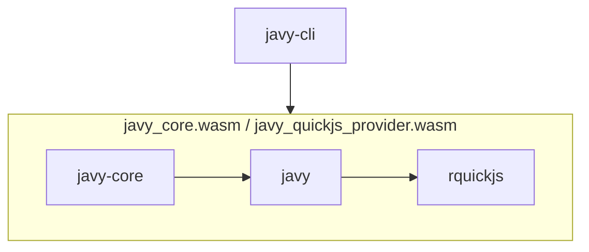

# Architecture of Javy

This document is intended to provide an overview of the crates and NPM packages in Javy.

## Crates



We anticipate most changes will be to the `javy-cli` and `javy` crates.

### `javy`

The entrypoint for working with Javy as a library for third parties. This crate is intended to compile to `wasm32-wasi` and provide ergonomic APIs for configuring a QuickJS-based runtime. If there is a configuration option for QuickJS that would be helpful, this is the place to add it.

#### Important concepts

- `javy::Runtime` - a configurable QuickJS runtime.
- `javy::Config` - a configuration for the runtime.

#### Example of a change

This is a contrived example of how to make a change. If I want to add a configuuration to set a global variable called `javy_rocks` to `true`, I would do the following:

In `crates/javy/src/config.rs`:

```diff
  /// A configuration for [`Runtime`](crate::Runtime).
  #[derive(Debug)]
  pub struct Config {
+     pub(crate) set_javy_rocks: bool,
  }

  impl Default for Config {
      /// Creates a [`Config`] with default values.
      fn default() -> Self {
          Self {
+             set_javy_rocks: false,
          }
      }
  }

  impl Config {
+     /// Sets `globalThis.javy_rocks` to `true`.
+     pub fn set_javy_rocks(&mut self) -> &mut Self {
+         self.set_javy_rocks = true;
+         self
+     }
  }
```

We require creating a method to set the property and it should return `&mut Self` so it can be chained.

In `crates/javy/src/runtime.rs`:

```diff
  impl Runtime {
      /// Creates a new [`Runtime`].
      pub fn new(config: Config) -> Result<Self> {
          let context = JSContextRef::default();
+         if config.set_javy_rocks {
+             context
+                 .global_object()?
+                 .set_property("javy_rocks", context.value_from_bool(true)?)?;
+         }
          Ok(Self { context })
      }
```

Read the `config` and call the appropriate methods on `context` to apply the configuration.

#### When to add a Cargo feature

You should consider gating your feature by a Cargo feature when:

- Your feature would materially increase the size of the produced Wasm module.

These are guidelines and we're willing to discuss if a feature needs to be gated by a Cargo feature on a case-by-case basis.

### `javy-cli`

The CLI for compiling JS to Wasm. This isn't intended to be a CLI that accommodates all uses for all users but rather to provide a useful base of functionality. This is kind of similar to how Wasmtime ships with a crate and a CLI and doing non-generic things with Wasmtime requires writing your own CLI around the Wasmtime crate.

#### When to add a cargo feature

You should gate your feature with a cargo feature if:

- It's not commonly going to be used and it would complicate the CLI options to include enabling it. For example, printing the WAT of a dynamic module is not something users would want 99.9% of the time and including it as an option on the CLI would make the `--help` output harder for most users to understand.
- You want to have integration tests in the `javy-cli` crate that should only run when the `javy-core` crate is built with a non-default configuration (that is, with different cargo features enabled). For example, we introduced the `experimental_event_loop` cargo feature in the `javy-cli` crate since we test for different expected outputs when using a promise when the `experimental_event_loop` cargo feature is enabled on the `javy_core` crate compared to when that cargo feature is disabled.

### `javy-core`

Gets compiled to `javy_core.wasm` and `javy_quickjs_provider.wasm` for use by the CLI and in environments for running dynamically linked modules. This isn't intended to be used as a code library by third parties. Contains logic for driving the `javy` crate for Wasm modules generated by `javy-cli`.

#### When to add a cargo feature

You should gate your feature with a cargo feature if:

- You want to support building a Wasm module with an experimental configuration of the runtime. We do this for the event loop because the current implementation has not been thoroughly vetted. We also need a build of Javy with event loop support to run a number of web platform tests for text encoding.

## NPM packages

### `javy`

A JS library providing ergonomic helpers around the lower level APIs for I/O exposed by the `javy` crate.
