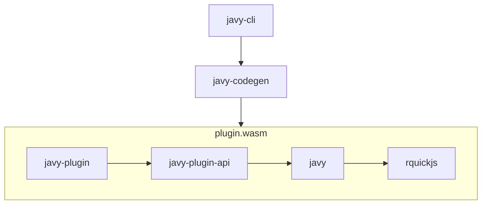

# Architecture of Javy

This document is intended to provide an overview of the architecture of `javy`.

## Crates



We anticipate most changes will be to the `javy-cli`, `javy-codegen`, and
`javy` crates.

### `javy`

The entrypoint for working with Javy as a library for third parties. This crate
is intended to compile to `wasm32-wasip1` and provide ergonomic APIs for
configuring a QuickJS-based runtime. If there is a configuration option for
QuickJS that would be helpful, this is the place to add it.

#### Important concepts

- `javy::Runtime` - a configurable QuickJS runtime.
- `javy::Config` - a configuration for the runtime.

#### Example

This is a contrived example of how to make a change. If I want to add
a configuration to set a global variable called `javy_rocks` to `true`, I would
do the following:

In `crates/javy/src/config.rs`:

```diff
  /// A configuration for [`Runtime`](crate::Runtime).
  #[derive(Debug)]
  pub struct Config {
+     pub(crate) javy_rocks: bool,
  }

  impl Default for Config {
      /// Creates a [`Config`] with default values.
      fn default() -> Self {
          Self {
+             javy_rocks: false,
          }
      }
  }

  impl Config {
+     /// Sets `globalThis.javy_rocks` to `true`.
+     pub fn javy_rocks(&mut self) -> &mut Self {
+         self.javy_rocks = true;
+         self
+     }
  }
```

In `crates/javy/src/apis/javy_rocks.rs`:

```rust
pub struct JavyRocks;

impl Instrinsic for JavyRocks {
    unsafe fn add_intrinsic(ctx: NonNull<qjs::JSContext>) {
        register(Ctx::from_raw(ctx)).expect("registering Javy Rocks to succeed")
    }
}

fn register<'js>(this: Ctx<'js>) -> Result<()> {
    let globals = this.globals();
    globals.set("javy_rocks", true);
}
```

In `crates/javy/src/runtime.rs`:

```diff
+        if cfg.javy_rocks {
+            unsafe {
+                JavyRocks::add_intrinsic(ctx.as_raw())
+            }
+        }
```

Define a new property on the `Config`, in `runtime`'s `build_from_config` add
the intrinsic if the config property is enabled, and use `context` to define the
configuration.

#### When to add a `cargo` feature

You should consider gating your feature by a Cargo feature when your feature
would materially increase the size of the produced Wasm module.

These are guidelines and we're willing to discuss if a feature needs to be gated
by a Cargo feature on a case-by-case basis.

### `javy-cli`

The CLI that drives the `javy-codegen` crate to compile JS to Wasm. This
isn't intended to be a CLI that accommodates all uses for all users but
rather to provide a useful base of functionality. 

#### When to add a `cargo` feature

You should gate your feature with a cargo feature if your feature/change:

- Is not commonly going to be used and it would complicate the CLI options to
  include enabling it. For example, printing the `.wat` of a dynamic module is not
  something users would want 99.9% of the time and including it as an option on
  the CLI would make the `--help` output harder for most users to understand.

- You want to have integration tests in the `javy-cli` crate that should only
  run when the `javy-plugin` crate is built with a non-default configuration (that
  is, with different cargo features enabled).

### `javy-codegen`

A Rust crate for compiling JS to Wasm.

### `javy-plugin-processing`

Contains the logic for initializing a Javy plugin. Used to build the default
plugin and also be the Javy CLI for its plugin initialization logic.

### `javy-plugin`

Gets compiled to `plugin.wasm` for use by the CLI and in environments for
running dynamically linked modules. This is the default plugin for Javy.
This isn't intended to be used as a code library by third parties. Defines a
an `initialize_runtime` function that uses a configuration structure to
allow the CLI to set various JS runtime configuration options.

#### When to add a `cargo` feature

You should gate your feature with a cargo feature if you want to support
building a Wasm module with a very unusual configuration of the runtime.

### `javy-plugin-api`

Used by Javy plugins to provide common implementations for exports and custom
sections the plugin is expected to expose. This drives the APIs exposed by the
`javy` crate. For example, this crate adds a Wasm function export for `invoke`
to the plugin which is used for actually running the JavaScript.

## `npm` packages

### `javy`

A JS library providing ergonomic helpers around the lower level APIs for I/O
exposed by the `javy` crate.
