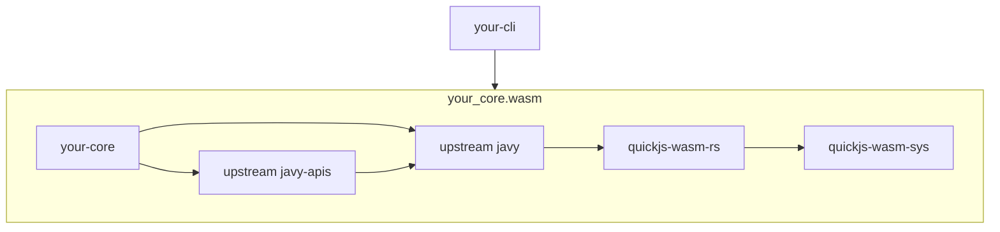

# Extending Javy

If you want to use Javy for your own project, you may find that the existing code is not sufficient since you may want to offer custom APIs or use different branding for the CLI. The approach we'd recommend taking is to create your own version of the `javy-cli` and `javy-core` crates (you could fork these if you would like) and depend on the upstream version of the `javy` and `javy-apis` crates. You can add your own implementations of custom JS APIs in your fork of the `javy-core` crate or in a different crate that you depend on in your `javy-core` fork. If you find that something is missing in the `javy` crate that you require to implement something in your fork, we would appreciate it if you would open a GitHub issue and consider making the change upstream instead of in your fork so all users of the `javy` crate can benefit.

See our documentation on [using complex data types in Wasm functions](complex-data-types-in-wasm-functions.md) for how to support Wasm functions that need to use byte arrays, strings, or structured data.

For a visual representation of how we expect forks to consume our crates:



## An example of changes you could make

Let's say you create a crate called `my-new-apis` with the following code in its `lib.rs` to define your new JS APIs:

```rust
use anyhow::Result;
use javy::Runtime;

pub fn register(runtime: &Runtime) -> Result<()> {
    let ctx = runtime.context();

    let global_object = ctx.global_object()?;

    // Registers a `SomeApi.foo` function.
    let some_api_object = ctx.object_value()?;
    some_api_object.set_property("foo", ctx.wrap_callback(|_ctx, _this, _args| todo!())?)?;
    global_object.set_property("SomeApi", some_api_object)?;

    // Registers a `SomeOtherApi.bar` function.
    let some_other_api_object = ctx.object_value()?;
    some_other_api_object.set_property("bar", ctx.wrap_callback(|_ctx, _this, _args| todo!())?)?;
    global_object.set_property("SomeOtherApi", some_other_api_object)?;

    Ok(())
}

```

We'd suggest registering your additional API code next to where you register the Javy APIs. For example, in Javy's core crate, it's in `crates/core/runtimes.rs`:

```diff
  pub(crate) fn new_runtime() -> Result<Runtime> {
      let mut api_config = APIConfig::default();
      api_config.log_stream(LogStream::StdErr);
-     Runtime::new_with_apis(Config::default(), api_config)
+     // Creates the Javy runtime and registers the Javy APIs.
+     let runtime = Runtime::new_with_apis(Config::default(), api_config)?;
+     // Registers your custom APIs.
+     my_new_apis::register(&runtime)?;
+     Ok(runtime)
  }
```

You are free to call `Runtime::new_with_apis` or another function to create your Javy `Runtime` and define and register your additional APIs wherever you would like in your own crate. This is just an example of one way you could do it.
