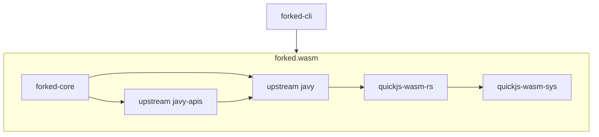

# Extending Javy

If you want to use Javy for your own project, you may find that the existing code is not sufficient since you may want to offer custom APIs or use different branding for the CLI. The approach we'd recommend taking is to fork and create your own version of the `javy-cli` and `javy-core` crates and depend on the upstream version of the `javy` and `javy-apis` crates. You can add your own implementations of custom JS APIs in your fork of the `javy-core` crate or in a different crate that you depend on in your `javy-core` fork. If you find that something is missing in the `javy` crate that you require to implement something in your fork, we would appreciate it if you would open a GitHub issue and consider making the change upstream instead of in your fork so all users of the `javy` crate can benefit.

See our documentation on [using complex data types in Wasm functions](complex-data-types-in-wasm-functions.md) for how to support Wasm functions that need to use byte arrays, strings, or structured data.

For a visual representation of how we expect forks to consume our crates:

